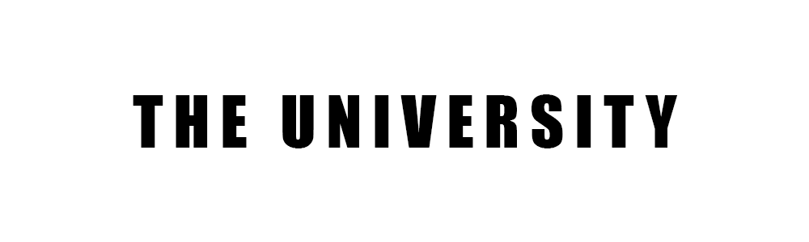

  

 
 
The university serves as a platform where I showcase applications designed specifically for teaching purposes across my diverse social media channels. 

**This is why I created this project**.

[Projects](#projects) •
[Key Features](#key-features) •
[How to make use of the playground](#how-to-make-use-of-the-playground) •
[Technologies Used](#technologies-used)

## Projects

<b>Projects 001 - Malware Analysis </b>

1. [``Malware Analysis 001 - Nasef's Keep Spreading #1 (Reading Lines)``](https://github.com/iamnasef/nks-readinglines) is a vulnerable machine build to showcase the strings utility tool.

<b>Projects 002 - Reverse Engineering </b>

1. [``Reverse Engineering 001 - Nasef's You Can't Crack Me #1 (See Through)``](https://github.com/iamnasef/nyccm-seethrough) is a vulnerable machine build to showcase the strings utility tool.

<b>Projects 003 - Boot2Root </b>

1. [``Boot2Root 001 - Nasef's Special Operation #1 (Locating Target)``](https://github.com/iamnasef/nso-locatingtarget) is an educational tool to explore the seven most common methods of Linux privilege escalation.

<b>Projects 004 - Linux Privilege Escalation </b>

1. [``Linux Privilege Escalation 001 - Nasef's No Permission #1 (LinESC)``](https://github.com/iamnasef/nnp-linesc) is a challenge where player take on the role of Agent R, tasked with leading a task force to rescue Agent N.A.S.E.F., who has gone missing during a secret mission in the enemy state "SOURG."

## Key Features

- The university platform offers a diverse collection of projects spanning multiple disciplines and technologies.
- Each project is complemented by a video guide, illustrating either the construction process for software and operations projects or the exploitation techniques for security projects.
- These projects serve as valuable resources for enriching your understanding and can be reconstructed from scratch to deepen your learning.
- Furthermore, social media are available to facilitate discussions and exchange ideas with fellow learners, fostering a collaborative learning environment.

## How you can make use of the project

1. Carefully review the project description and endeavor to reconstruct it independently.
2. Conduct a thorough comparison between your code and the code available in the university.
3. Explore any embedded videos accompanying each project, if available, illustrating a step-by-step guide on how to build it. 
4. Feel free to reach out to me should you have any questions or concerns.

## Technologies Used

This is the list of technologies used in the project

| Application                                         | Description                                  
| --------------------------------------------------- |--------------------------------------------- 
| [C](https://simple.wikipedia.org/wiki/C_(programming_language))    | A general-purpose computer programming language.
| [Linux](https://www.linux.org/)    | A family of open-source Unix-like operating systems based on the Linux kernel     
| [Malware analysis](https://www.cisa.gov/resources-tools/services/malware-analysis)                           | A study or process of determining the functionality, origin and potential impact of a given malware sample such as a virus, worm, trojan horse, rootkit, or backdoor  
| [Reverse engineering](https://en.wikipedia.org/wiki/Reverse_engineering)                           | A lightweight markup language for creating formatted text using a plain-text editor language                   
| [Markdown](https://www.markdownguide.org/)                           | A lightweight markup language for creating formatted text using a plain-text editor language                 